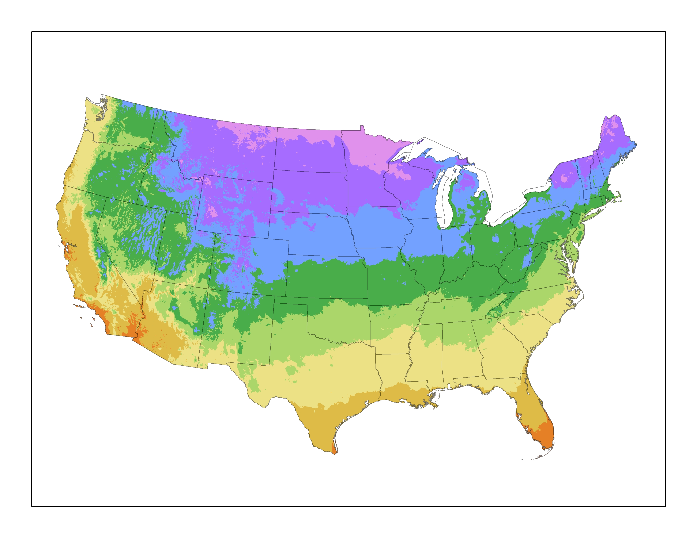
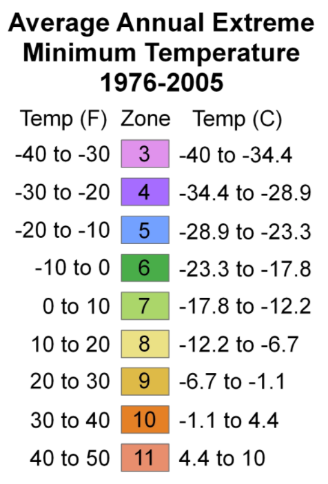

# Plant Hardiness Zone Map

The USDA created a standard to which gardeners can use to determine which plants can survive in which locations.  This data is based on the average annual minimum winter temperature divided into 10 degree Fahrenheit zones.  This map was created in 2012 and is a great guide for gardeners to use to decide what plants they can grow and survive through the winter.

At Plant Addicts we do our best to list the most accurate data on each plant page. So make sure you look to see which zones a plant can grow in before ordering. You can bend the guidelines somewhat by planting in more sheltered areas, or if you live in a micro-climate. But we recommend using the plant growing zones as your guide to decide what to plant outside.

If you are unsure what growing zone you are in, you can enter in your zip code in the tool at the top right of the website and it will tell you. Or you can tell from the map below too.

 

## First & Last Frost Date By Growing Zone

<table>
<tbody>
<tr>
<th><strong>Zone</strong></th>
<th><strong>Last Frost Date</strong></th>
<th><strong>First Frost Date</strong></th>
</tr>
<tr></tr>
<tr>
<td>1</td>
<td>May 22 – June 4</td>
<td>August 25-31</td>
</tr>
<tr></tr>
<tr>
<td>2</td>
<td>May 15-22</td>
<td>September 1-8</td>
</tr>
<tr></tr>
<tr>
<td>3</td>
<td>May 1-16</td>
<td>September 8-15</td>
</tr>
<tr></tr>
<tr>
<td>4</td>
<td>April 24 – May 12</td>
<td>September 21 – October 7</td>
</tr>
<tr></tr>
<tr>
<td>5</td>
<td>April 7-30</td>
<td>October 13 – October 21</td>
</tr>
<tr></tr>
<tr>
<td>6</td>
<td>April 1-21</td>
<td>October 17-31</td>
</tr>
<tr></tr>
<tr>
<td>7</td>
<td>March 22 – April 3</td>
<td>October 29 – November 15</td>
</tr>
<tr></tr>
<tr>
<td>8</td>
<td>March 13-28</td>
<td>November 7-28</td>
</tr>
<tr></tr>
<tr>
<td>9</td>
<td>February 6-28</td>
<td>November 25 – December 13</td>
</tr>
<tr></tr>
<tr>
<td data-sheets-numberformat="{">10-13</td>
<td>No freeze</td>
<td>No freeze</td>
</tr>
</tbody>
</table>

### States in Growing Zone 1

Alaska

### States in Growing Zone 2

Alaska

### States in Growing Zone 3

Alaska, Colorado, Idaho, Maine, Minnesota, Montana, New Hampshire, New York, North Dakota, Vermont, Wisconsin, Wyoming

### States in Growing Zone 4

Alaska, Arizona, Colorado, Idaho, Iowa, Maine,Michigan, Minnesota, Montana, Nebraska, Nevada, New Hampshire, New Mexico, New York, North Dakota, Oregon, Utah, Vermont, Washington, Wisconsin, Wyoming

### States in Growing Zone 5

Alaska, Arizona, California, Colorado, Connecticut, Rhode Island, Idaho, Illinois, Indiana, Iowa, Kansas, Maine, Maryland, Massachusetts, Michigan, Minnesota, Missouri, Montana, Nebraska, Nevada, New Hampshire, New Mexico, New York, North Carolina, Ohio, Oregon, Pennsylvania, Tennessee, Utah, Vermont, Virginia, Washington, West Virginia, Wisconsin, Wyoming

### States in Growing Zone 6

Alaska, Arizona, California, Colorado, Connecticut, Rhode Island, Georgia, Idaho, Illinois, Indiana, Iowa, Kansas, Kentucky, Maine, Maryland, Massachusetts, Michigan, Missouri, Montana, Nevada, New Hampshire, New Jersey, New Mexico, New York, North Carolina, Ohio, Oklahoma, Oregon, Pennsylvania, Tennessee, Texas, Utah, Virginia, Washington, West Virginia, Wyoming

### States in Growing Zone 7

Alaska, Alabama, Arizona, Arkansas, California, Colorado, Connecticut, Rhode Island, Delaware, Georgia, Idaho, Illinois, Kansas, Kentucky, Maryland, Massachusetts, Mississippi, Missouri, Nevada, New Jersey, New Mexico, New York, North Carolina, Oklahoma, Oregon, Pennsylvania, South Carolina, Tennessee, Texas, Utah, Virginia, Washington, West Virginia

### States in Growing Zone 8

Alaska, Alabama, Arizona, Arkansas, California, Florida, Georgia, Louisiana, Maryland, Mississippi, Nevada, New Mexico, North Carolina, Oklahoma, Oregon, South Carolina, Tennessee, Texas, Utah, Virginia, Washington

### States in Growing Zone 9

Alabama, Arizona, California, Florida, Georgia, Hawaii, Louisiana, Mississippi, Nevada, New Mexico, Oregon, South Carolina, Texas, Utah, Washington

### States in Growing Zone 10

Arizona, California, Florida, Hawaii, Louisiana, Nevada, Texas 

### States in Growing Zone 11

California, Florida, Hawaii

### States in Growing Zone 12
Hawaii

### States in Growing Zone 13
Hawaii

